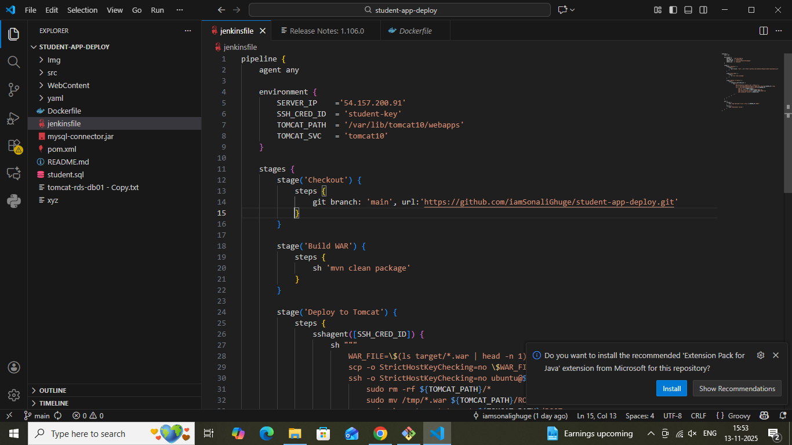
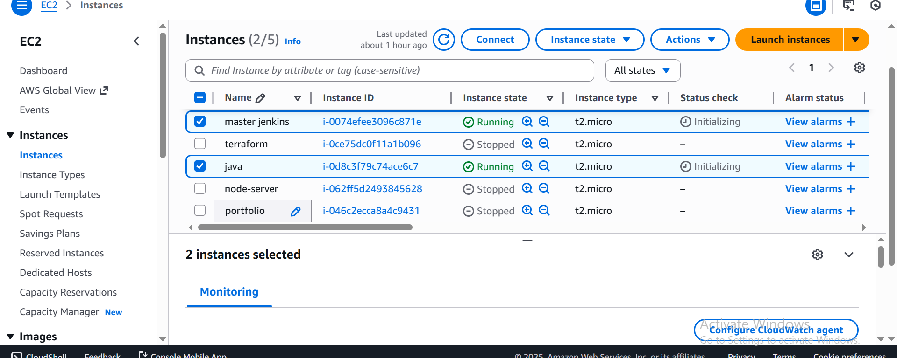
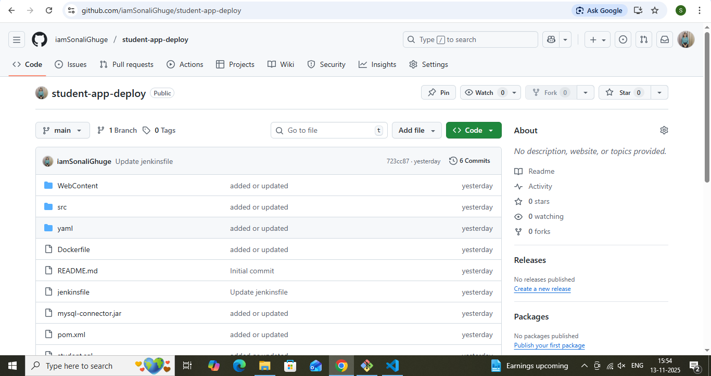

# Student App - Complete DevOps CI/CD Project 

A Java-based Student Management Web Application fully deployed using an end-to-end CI/CD pipeline built with Git, GitHub, Jenkins, AWS EC2 (Ubuntu), Maven, and Apache Tomcat.

This project demonstrates how to automate the entire development and deployment process — from code commit → build → deployment — using Jenkins pipelines and cloud infrastructure.

## Project Overview
The Student App allows users to enter and manage student data such as name, age, qualification, percentage, and passing year.

This project focuses on automating deployment through Continuous Integration and Continuous Deployment (CI/CD) using Jenkins and AWS EC2 instances.
It provides a real-world example of DevOps implementation for Java applications.

.png)

## Objective
To create a fully automated deployment pipeline using Jenkins that performs the following tasks:

1. Developer clones project from GitHub and makes changes locally.
2. Changes are pushed to a personal GitHub repository (master branch).
3. Jenkins automatically detects changes and pulls the latest code.
4. Maven builds the Java project and generates a .war file.
5. Jenkins securely copies the .war file to a Tomcat server hosted on another EC2 instance.
6. The web application automatically restarts and is available for access on the browser.

| Category | Tools/Technology |
|-----------|-----------|
|   Language |	Java
Build Tool	|Maven
Version Control	|Git & GitHub
Automation Tool|	Jenkins
Cloud Platform	|AWS EC2 (Ubuntu)
Server	Apache | Tomcat 10
Pipeline Type	|Jenkins Declarative Pipeline
 | 

 CI/CD Workflow Diagram
 

Each stage is fully automated, ensuring zero manual deployment effort.

### Jenkinsfile Explanation
Here’s the Jenkinsfile used for building and deploying the application automatically
 
## AWS EC2 Setup Details

| Instance | Purpose | Configuration |
|-------------|----------------|-----------|
|   EC2-1	|Jenkins Server|	Ubuntu 22.04, Jenkins, Java, Maven, Git
EC2-2	|Application Server	|Ubuntu 22.04, Apache Tomcat 10, Java|         |   |

### SSH Configuration
- SSH key pair node-app-key generated.
- Private key added to Jenkins Credentials under “SSH Agent”.
- Passwordless SSH established between Jenkins and Tomcat EC2 instances.

## Deployment Steps Summary
1. Developer commits changes → GitHub Repository.
2. Jenkins auto-triggers pipeline.
3. Maven builds and generates the .war file.
4. Jenkins deploys .war to EC2 (Tomcat).
5. Application automatically restarts on Tomcat.

## Output (Deployed App)

Once deployed successfully, the app displays the Student Admission Form:

Fields include:

- Student Name
- Address
- Age
- Qualification
- Percentage
- Year Passed

##  Screenshots & Descriptions

| Screenshot | Description |
|-------------|-------------|
|  | **🚀 Deploy Student Admission Form** Successfully deployed the student admission form application on AWS EC2 using Jenkins pipeline. |
|  | **✅ Build Success** Jenkins build executed successfully with no errors; all stages completed. |
|  | **💻 Instances** Multiple AWS EC2 instances created for Jenkins, Web App, and Database configuration. |
|  | **📂 GitHub Repository** Source code hosted on GitHub with Jenkinsfile and project files for CI/CD setup. |
|  | **⚙️ Jenkinsfile** Pipeline configuration includes stages: Clone Repo → Build → Deploy → Verify. |

### Author
Sonali Ghuge
 DevOps | Cloud | CI/CD | 

 ## Conclusion
This project demonstrates a complete DevOps workflow — integrating Git, GitHub, Jenkins, Maven, AWS EC2, and Tomcat for real-world CI/CD implementation.

 It automates the deployment lifecycle, increases reliability, and eliminates manual effort — a core DevOps principle.

 If you found this project helpful, don’t forget to star the repo! 